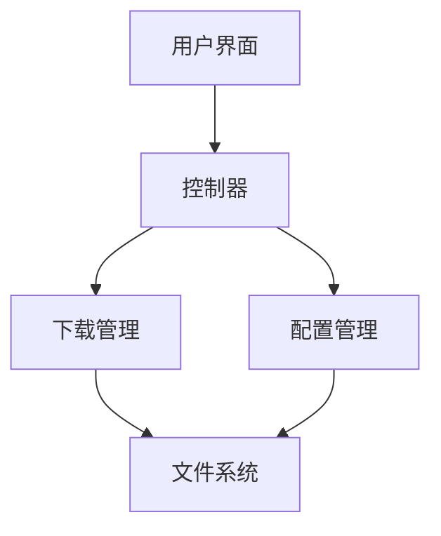

# Blender 版本管理工具 (Blender Version Management Tool)

<div align="center">


[](LICENSE)
[](https://www.python.org/downloads/)
[](https://www.riverbankcomputing.com/software/pyqt/)
[](https://github.com/your-username/blender-version-manager)

[简体中文](README.md) | [English](README_en.md)

一个强大的 Blender 版本管理工具，支持多版本下载、安装、切换和管理。

</div>

## 📑 目录

- [特性](#-特性)
- [安装指南](#-安装指南)
  - [系统要求](#系统要求)
  - [安装步骤](#安装步骤)
  - [从源码安装](#从源码安装)
- [快速开始](#-快速开始)
- [使用指南](#-使用指南)
  - [界面概述](#界面概述)
  - [基本操作](#基本操作)
  - [高级功能](#高级功能)
- [配置说明](#-配置说明)
- [多语言支持](#-多语言支持)
- [主题设置](#-主题设置)
- [常见问题](#-常见问题)
- [开发者指南](#-开发者指南)
  - [项目结构](#项目结构)
  - [开发环境设置](#开发环境设置)
  - [构建说明](#构建说明)
  - [测试指南](#测试指南)
  - [贡献指南](#贡献指南)
- [更新日志](#-更新日志)
- [技术架构](#-技术架构)
- [许可证](#-许可证)
- [鸣谢](#-鸣谢)

## ✨ 特性

### 核心功能
- 🚀 自动检测和管理多个 Blender 版本
- 📥 支持在线下载各版本 Blender
- 🔄 快速切换不同版本
- 💾 自动备份和恢复用户配置
- 🌐 多语言界面支持
- 🎨 深色/浅色主题切换
- 📊 版本使用统计
- 🔍 智能版本搜索
- 🛠️ 配置文件管理

### 高级特性
- 🔒 安全的配置文件存储
- 🌍 全球化下载源支持
- 📦 便携版本支持
- 🔄 增量更新支持
- 🎮 插件管理功能
- 📋 详细的操作日志
- ⚡ 多线程下载加速
- 🔧 自定义安装路径
- 📱 响应式界面设计

## 🚀 安装指南

### 系统要求

#### Windows
- Windows 10/11 64位
- Python 3.8+
- 4GB+ RAM
- 1GB+ 可用磁盘空间

#### Linux
- Ubuntu 20.04+/Fedora 34+
- Python 3.8+
- 4GB+ RAM
- 1GB+ 可用磁盘空间

#### macOS
- macOS 10.15+
- Python 3.8+
- 4GB+ RAM
- 1GB+ 可用磁盘空间

### 安装步骤

1. 下载最新发布版本
```bash
git clone https://github.com/your-username/blender-version-manager.git
cd blender-version-manager
```

2. 安装依赖
```bash
pip install -r requirements.txt
```

3. 运行程序
```bash
python blender_version_manager.py
```

### 从源码安装

1. 克隆仓库
```bash
git clone https://github.com/your-username/blender-version-manager.git
```

2. 创建虚拟环境
```bash
python -m venv venv
source venv/bin/activate  # Linux/macOS
venv\Scripts\activate     # Windows
```

3. 安装开发依赖
```bash
pip install -r requirements-dev.txt
```

4. 构建程序
```bash
python setup.py build
```

## 🎯 快速开始

1. 首次启动程序
2. 设置 Blender 安装目录
3. 点击"刷新"获取可用版本
4. 选择需要的版本进行下载/安装
5. 使用版本切换功能

## 📖 使用指南

### 界面概述

#### 主窗口
- 工具栏：快速访问常用功能
- 版本列表：显示所有可用版本
- 状态栏：显示当前操作状态
- 设置按钮：访问程序配置

#### 设置对话框
- 常规设置
- 下载设置
- 备份设置
- 主题设置
- 语言设置

### 基本操作

#### 版本管理
1. 获取版本列表
2. 下载新版本
3. 切换版本
4. 删除版本

#### 配置管理
1. 备份配置
2. 恢复配置
3. 重置设置

### 高级功能

#### 自定义下载源
```ini
[PREFERENCES]
SourceURL = https://download.blender.org/release/
```

#### 多线程下载
```ini
[PREFERENCES]
ThreadCount = 4
```

#### 自动更新检查
```ini
[PREFERENCES]
AutoFetch = True
```

## ⚙️ 配置说明

### 配置文件位置
- Windows: `%USERPROFILE%/blender_version_manager_config.ini`
- Linux/macOS: `~/blender_version_manager_config.ini`

### 配置项说明

#### 常规设置
```ini
[PREFERENCES]
AutoFetch = True          # 自动获取版本列表
FolderPath = D:/Blender   # Blender安装路径
BackupFolder = D:/Backup  # 备份文件夹路径
```

#### 下载设置
```ini
[PREFERENCES]
SourceURL = https://download.blender.org/release/
ThreadCount = 4           # 下载线程数
```

#### 界面设置
```ini
[PREFERENCES]
Theme = System           # 主题 (System/Dark)
Language = zh_CN        # 界面语言
```

## 🌍 多语言支持

### 支持的语言
- 简体中文 (zh_CN)
- 英语 (en_US)
- 德语 (de_DE)
- 日语 (ja_JP)
- 俄语 (ru_RU)

### 添加新语言
1. 在 `locale` 目录创建新语言文件夹
2. 复制 `messages.pot` 到新文件夹
3. 重命名为 `messages.po`
4. 翻译所有字符串
5. 编译 `.mo` 文件

### 语言文件结构
```
locale/
├── zh_CN/
│   ├── LC_MESSAGES/
│   │   ├── messages.po
│   │   └── messages.mo
├── en_US/
│   ├── LC_MESSAGES/
│   │   ├── messages.po
│   │   └── messages.mo
└── ...
```

## 🎨 主题设置

### 支持的主题
- System (跟随系统)
- Dark (深色主题)

### 自定义主题
```python
# 主题配置示例
THEMES = {
    'Dark': {
        'background': '#2b2b2b',
        'foreground': '#ffffff',
        'accent': '#007acc'
    }
}
```

## ❓ 常见问题

### 1. 下载失败怎么办？
- 检查网络连接
- 尝试切换下载源
- 增加重试次数

### 2. 版本切换失败？
- 确保目标版本完整下载
- 检查文件权限
- 关闭所有 Blender 进程

### 3. 配置文件损坏？
- 使用备份恢复
- 重置为默认设置
- 手动编辑修复

## 👨‍💻 开发者指南

### 项目结构
```
Blender-VMT-Remastered/
├── blender_version_manager.py  # 主程序
├── lang/                       # 语言文件
├── icons/                      # 图标资源
```

### 开发环境设置

#### 必要工具
- Python 3.8+
- Git
- VSCode/PyCharm
- Qt Designer

#### 开发依赖
```bash
pip install -r requirements-dev.txt
```

### 构建说明

#### Windows
```bash
pyinstaller --onefile --windowed --icon=icons/Blender-VMT.ico blender_version_manager.py
```

#### Linux
```bash
pyinstaller --onefile --windowed blender_version_manager.py
```

#### macOS
```bash
pyinstaller --onefile --windowed --icon=icons/Blender-VMT.icns blender_version_manager.py
```

### 测试指南

#### 单元测试
```bash
python -m pytest tests/
```

#### 覆盖率测试
```bash
coverage run -m pytest
coverage report
```

#### 性能测试
```bash
python -m cProfile -o output.prof blender_version_manager.py
```

### 贡献指南

#### 提交规范
```
feat: 新功能
fix: 修复问题
docs: 文档更新
style: 代码格式
refactor: 代码重构
test: 测试相关
chore: 构建相关
```

#### 分支管理
- main: 主分支
- develop: 开发分支
- feature/*: 功能分支
- bugfix/*: 修复分支

#### 代码风格
- 遵循 PEP 8
- 使用类型注解
- 编写文档字符串

## 📝 更新日志

### v1.0.0 (2024-03-xx)
- 初始版本发布
- 基础版本管理功能
- 多语言支持
- 主题切换

### v1.1.0 (计划中)
- 插件管理
- 自动更新
- 性能优化

## 🏗️ 技术架构

### 核心模块

#### GUI 模块
- PyQt6 界面框架
- QSS 样式表
- 事件驱动架构

#### 下载模块
- 多线程下载
- 断点续传
- 校验机制

#### 配置模块
- INI 配置文件
- 加密存储
- 版本控制

#### 国际化模块
- Babel 框架
- 动态加载
- 实时切换

### 数据流



### 性能优化

#### 内存管理
- 延迟加载
- 资源池化
- 垃圾回收

#### 并发处理
- 异步操作
- 线程池
- 任务队列

## 📄 许可证

本项目采用 GPL3 许可证。详见 [LICENSE](LICENSE) 文件。

```
Blender版本管理器 - 一个用于管理 Blender 版本的工具
Copyright (C) 2024 dhjs0000

This program is free software: you can redistribute it and/or modify
it under the terms of the GNU General Public License as published by
the Free Software Foundation, either version 3 of the License, or
(at your option) any later version.

This program is distributed in the hope that it will be useful,
but WITHOUT ANY WARRANTY; without even the implied warranty of
MERCHANTABILITY or FITNESS FOR A PARTICULAR PURPOSE.  See the
GNU General Public License for more details.

You should have received a copy of the GNU General Public License
along with this program.  If not, see <https://www.gnu.org/licenses/>.
```

## 🙏 鸣谢

### 开源项目
- [PyQt](https://riverbankcomputing.com/software/pyqt/)
- [Babel](http://babel.pocoo.org/)
- [requests](https://requests.readthedocs.io/)

### 贡献者
- dhjs0000

### 特别感谢
- Blender 基金会
- 开源社区
- 所有用户

## 📞 联系方式

- 问题反馈：[Issues](https://github.com/dhjs0000/Blender-VMT-Remastered/issues)
- 邮件联系：3110197220@qq.com
- 社区讨论：[Discussions](https://github.com/dhjs0000/Blender-VMT-Remastered/discussions)

---

<div align="center">

**[⬆ 返回顶部](#blender-版本管理工具-blender-version-management-tool)**

如果这个项目对您有帮助，请考虑给它一个星标 ⭐️，谢谢！

</div> 