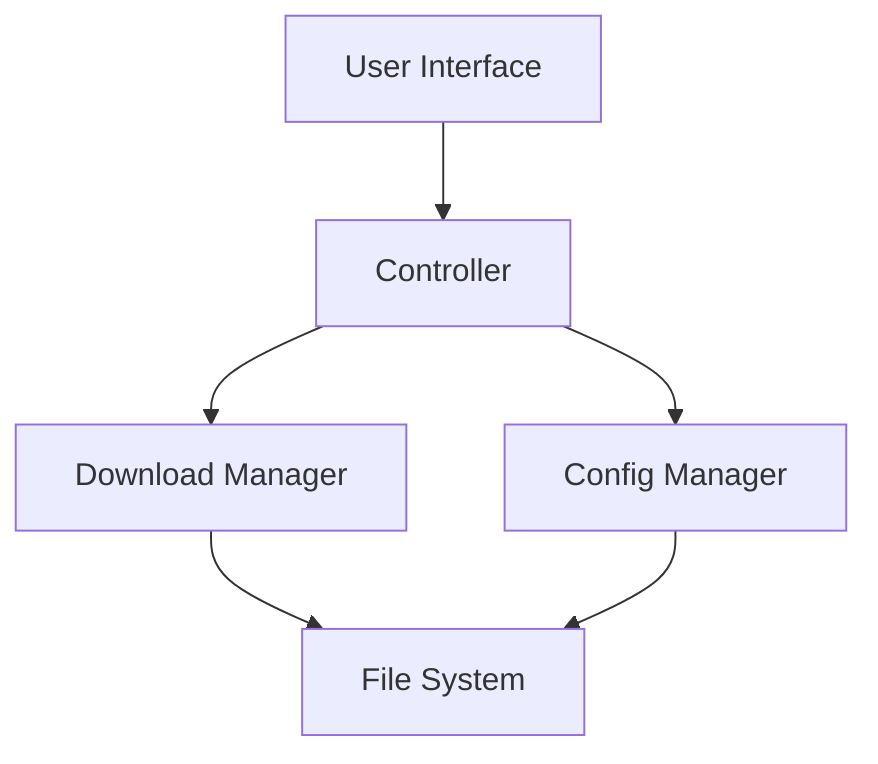

# Blender Version Management Tool

<div align="center">


[](LICENSE)
[](https://www.python.org/downloads/)
[](https://www.riverbankcomputing.com/software/pyqt/)
[](https://github.com/your-username/blender-version-manager)

[简体中文](README.md) | [English](README_en.md)

A powerful Blender version management tool that supports multi-version download, installation, switching, and management.

</div>

## 📑 Table of Contents

- [Features](#-features)
- [Installation Guide](#-installation-guide)
  - [System Requirements](#system-requirements)
  - [Installation Steps](#installation-steps)
  - [Install from Source](#install-from-source)
- [Quick Start](#-quick-start)
- [User Guide](#-user-guide)
  - [Interface Overview](#interface-overview)
  - [Basic Operations](#basic-operations)
  - [Advanced Features](#advanced-features)
- [Configuration](#-configuration)
- [Multi-language Support](#-multi-language-support)
- [Theme Settings](#-theme-settings)
- [FAQ](#-faq)
- [Developer Guide](#-developer-guide)
  - [Project Structure](#project-structure)
  - [Development Environment](#development-environment)
  - [Build Instructions](#build-instructions)
  - [Testing Guide](#testing-guide)
  - [Contribution Guidelines](#contribution-guidelines)
- [Changelog](#-changelog)
- [Technical Architecture](#-technical-architecture)
- [License](#-license)
- [Acknowledgments](#-acknowledgments)

## ✨ Features

### Core Features
- 🚀 Automatic detection and management of multiple Blender versions
- 📥 Support for downloading various Blender versions
- 🔄 Quick switching between different versions
- 💾 Automatic backup and restoration of user configurations
- 🌐 Multi-language interface support
- 🎨 Dark/Light theme switching
- 📊 Version usage statistics
- 🔍 Smart version search
- 🛠️ Configuration file management

### Advanced Features
- 🔒 Secure configuration file storage
- 🌍 Global download source support
- 📦 Portable version support
- 🔄 Incremental update support
- 🎮 Plugin management functionality
- 📋 Detailed operation logs
- ⚡ Multi-threaded download acceleration
- 🔧 Custom installation paths
- 📱 Responsive interface design

## 🚀 Installation Guide

### System Requirements

#### Windows
- Windows 10/11 64-bit
- Python 3.8+
- 4GB+ RAM
- 1GB+ available disk space

#### Linux
- Ubuntu 20.04+/Fedora 34+
- Python 3.8+
- 4GB+ RAM
- 1GB+ available disk space

#### macOS
- macOS 10.15+
- Python 3.8+
- 4GB+ RAM
- 1GB+ available disk space

### Installation Steps

1. Download the latest release
```bash
git clone https://github.com/your-username/blender-version-manager.git
cd blender-version-manager
```

2. Install dependencies
```bash
pip install -r requirements.txt
```

3. Run the program
```bash
python blender_version_manager.py
```

### Install from Source

1. Clone the repository
```bash
git clone https://github.com/your-username/blender-version-manager.git
```

2. Create virtual environment
```bash
python -m venv venv
source venv/bin/activate  # Linux/macOS
venv\Scripts\activate     # Windows
```

3. Install development dependencies
```bash
pip install -r requirements-dev.txt
```

4. Build the program
```bash
python setup.py build
```

## 🎯 Quick Start

1. Launch the program
2. Set Blender installation directory
3. Click "Refresh" to get available versions
4. Select desired version for download/installation
5. Use version switching functionality

## 📖 User Guide

### Interface Overview

#### Main Window
- Toolbar: Quick access to common functions
- Version List: Display all available versions
- Status Bar: Show current operation status
- Settings Button: Access program configuration

#### Settings Dialog
- General Settings
- Download Settings
- Backup Settings
- Theme Settings
- Language Settings

### Basic Operations

#### Version Management
1. Get version list
2. Download new version
3. Switch version
4. Delete version

#### Configuration Management
1. Backup configuration
2. Restore configuration
3. Reset settings

### Advanced Features

#### Custom Download Source
```ini
[PREFERENCES]
SourceURL = https://download.blender.org/release/
```

#### Multi-threaded Download
```ini
[PREFERENCES]
ThreadCount = 4
```

#### Automatic Update Check
```ini
[PREFERENCES]
AutoFetch = True
```

## ⚙️ Configuration

### Configuration File Location
- Windows: `%USERPROFILE%/blender_version_manager_config.ini`
- Linux/macOS: `~/blender_version_manager_config.ini`

### Configuration Items

#### General Settings
```ini
[PREFERENCES]
AutoFetch = True          # Auto fetch version list
FolderPath = D:/Blender   # Blender installation path
BackupFolder = D:/Backup  # Backup folder path
```

#### Download Settings
```ini
[PREFERENCES]
SourceURL = https://download.blender.org/release/
ThreadCount = 4           # Download threads
```

#### Interface Settings
```ini
[PREFERENCES]
Theme = System           # Theme (System/Dark)
Language = en_US        # Interface language
```

## 🌍 Multi-language Support

### Supported Languages
- Simplified Chinese (zh_CN)
- English (en_US)
- German (de_DE)
- Japanese (ja_JP)
- Russian (ru_RU)

### Adding New Language
1. Create new language folder in `locale` directory
2. Copy `messages.pot` to new folder
3. Rename to `messages.po`
4. Translate all strings
5. Compile `.mo` file

### Language File Structure
```
locale/
├── zh_CN/
│   ├── LC_MESSAGES/
│   │   ├── messages.po
│   │   └── messages.mo
├── en_US/
│   ├── LC_MESSAGES/
│   │   ├── messages.po
│   │   └── messages.mo
└── ...
```

## 🎨 Theme Settings

### Supported Themes
- System (Follow system)
- Dark (Dark theme)

### Custom Theme
```python
# Theme configuration example
THEMES = {
    'Dark': {
        'background': '#2b2b2b',
        'foreground': '#ffffff',
        'accent': '#007acc'
    }
}
```

## ❓ FAQ

### 1. What if download fails?
- Check network connection
- Try switching download source
- Increase retry count

### 2. Version switching fails?
- Ensure target version is completely downloaded
- Check file permissions
- Close all Blender processes

### 3. Configuration file corrupted?
- Restore from backup
- Reset to default settings
- Manual edit fix

## 👨‍💻 Developer Guide

### Project Structure
```
Blender-VMT-Remastered/
├── blender_version_manager.py  # Main program
├── lang/                       # Language files
├── icons/                      # Icon resources
```

### Development Environment

#### Required Tools
- Python 3.8+
- Git
- VSCode/PyCharm
- Qt Designer

#### Development Dependencies
```bash
pip install -r requirements-dev.txt
```

### Build Instructions

#### Windows
```bash
pyinstaller --onefile --windowed --icon=icons/Blender-VMT.ico blender_version_manager.py
```

#### Linux
```bash
pyinstaller --onefile --windowed blender_version_manager.py
```

#### macOS
```bash
pyinstaller --onefile --windowed --icon=icons/Blender-VMT.icns blender_version_manager.py
```

### Testing Guide

#### Unit Tests
```bash
python -m pytest tests/
```

#### Coverage Tests
```bash
coverage run -m pytest
coverage report
```

#### Performance Tests
```bash
python -m cProfile -o output.prof blender_version_manager.py
```

### Contribution Guidelines

#### Commit Convention
```
feat: New feature
fix: Bug fix
docs: Documentation update
style: Code formatting
refactor: Code refactoring
test: Testing related
chore: Build related
```

#### Branch Management
- main: Main branch
- develop: Development branch
- feature/*: Feature branches
- bugfix/*: Fix branches

#### Code Style
- Follow PEP 8
- Use type annotations
- Write docstrings

## 📝 Changelog

### v1.0.0 (2024-03-xx)
- Initial release
- Basic version management
- Multi-language support
- Theme switching

### v1.1.0 (Planned)
- Plugin management
- Auto-update
- Performance optimization

## 🏗️ Technical Architecture

### Core Modules

#### GUI Module
- PyQt6 interface framework
- QSS stylesheets
- Event-driven architecture

#### Download Module
- Multi-threaded download
- Resume support
- Verification mechanism

#### Configuration Module
- INI configuration file
- Encrypted storage
- Version control

#### Internationalization Module
- Babel framework
- Dynamic loading
- Real-time switching

### Data Flow



### Performance Optimization

#### Memory Management
- Lazy loading
- Resource pooling
- Garbage collection

#### Concurrent Processing
- Asynchronous operations
- Thread pool
- Task queue

## 📄 License

This project is licensed under the GPL3 License. See the [LICENSE](LICENSE) file for details.

```
Blender Version Manager - A tool for managing Blender versions
Copyright (C) 2024 dhjs0000

This program is free software: you can redistribute it and/or modify
it under the terms of the GNU General Public License as published by
the Free Software Foundation, either version 3 of the License, or
(at your option) any later version.

This program is distributed in the hope that it will be useful,
but WITHOUT ANY WARRANTY; without even the implied warranty of
MERCHANTABILITY or FITNESS FOR A PARTICULAR PURPOSE.  See the
GNU General Public License for more details.

You should have received a copy of the GNU General Public License
along with this program.  If not, see <https://www.gnu.org/licenses/>.
```

## 🙏 Acknowledgments

### Open Source Projects
- [PyQt](https://riverbankcomputing.com/software/pyqt/)
- [Babel](http://babel.pocoo.org/)
- [requests](https://requests.readthedocs.io/)

### Contributors
- dhjs0000

### Special Thanks
- Blender Foundation
- Open Source Community
- All Users

## 📞 Contact

- Issue Tracker: [Issues](https://github.com/dhjs0000/Blender-VMT-Remastered/issues)
- Email: 3110197220@qq.com
- Community: [Discussions](https://github.com/dhjs0000/Blender-VMT-Remastered/discussions)

---

<div align="center">

**[⬆ Back to Top](#blender-version-management-tool)**

If this project helps you, please consider giving it a star ⭐️

</div> 